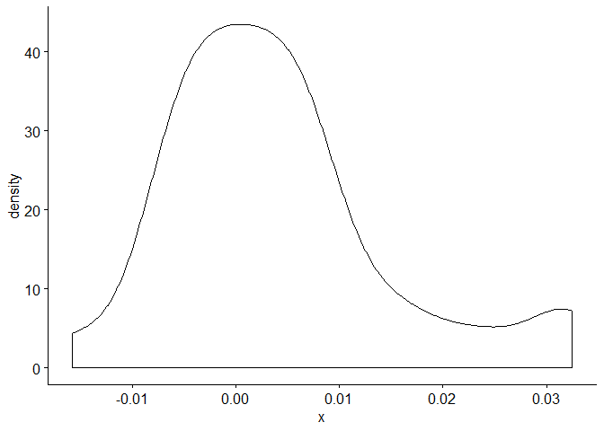
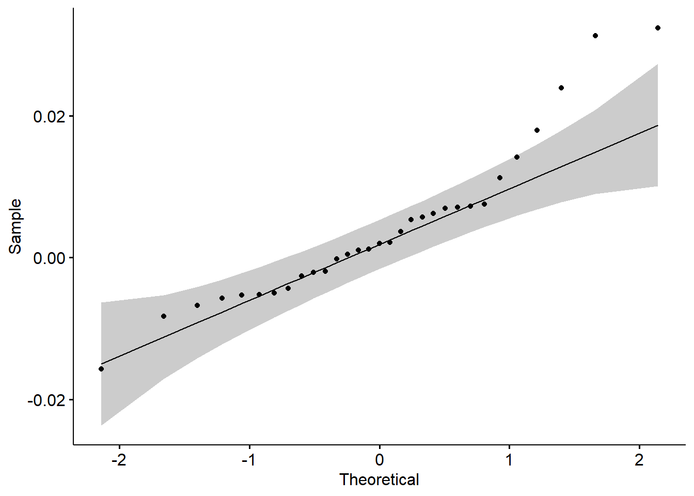
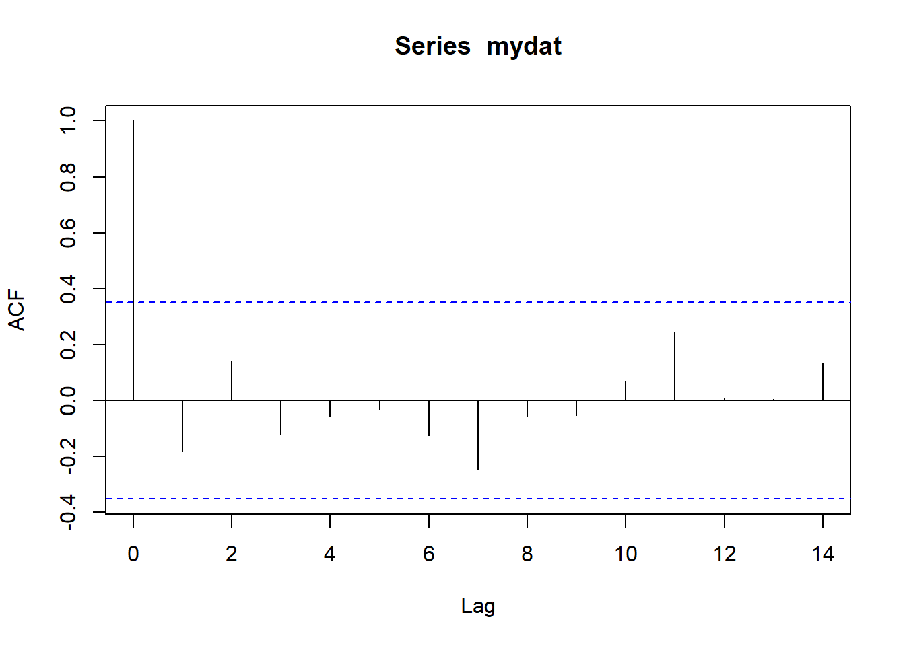

Bootstrapping is a useful tool for understanding properties of your data, especially when you suspect your data may not be normally distributed.  We are big fans of bootstrapping.  Basically, you can't go wrong.   Even if your data are normally distributed, you won't be hurt by bootstrapping.

The theory of bootstrapping is explained in these excellent [youtube videos](https://www.youtube.com/watch?v=STGGniMV0jg).

### Analytical methods

First, get data.  We are using a small data set of only 31 observations.


```r
mydat=read.csv("some_excess_returns.csv")
mydat=mydat[,2]
n=length(mydat)
mydat
```

```
##  [1]  0.002126049  0.031321471  0.007239062  0.011299299 -0.004313139
##  [6]  0.007571593  0.007123522 -0.005725123 -0.006748672 -0.001943070
## [11]  0.001199898  0.006206891  0.001020341  0.014193958  0.003672167
## [16]  0.005371602  0.023966600  0.000446228 -0.005197718 -0.002057253
## [21] -0.000169055  0.006971489 -0.005288180 -0.008264877  0.005729899
## [26]  0.017965263 -0.005026542  0.032432124 -0.015744732  0.002013650
## [31] -0.002576472
```

Now we will calculate the mean, variance and standard deviation and standard errors for each of these by standard analytical methods which presume normality.


```r
muhat=mean(mydat)
varhat=var(mydat)
sdhat=sd(mydat)
se.muhat=sdhat/sqrt(n)
se.varhat=varhat/sqrt(n/2)
se.sdhat=sdhat/sqrt(2*n)
results_an=matrix(c(muhat,varhat,sdhat,se.muhat,se.varhat,se.sdhat),nrow=3,ncol=2)
rownames(results_an)=c("Mean","Variance","Standard Deviation")
colnames(results_an)=c("Value","SE")
results_an
```

```
##                           Value           SE
## Mean               0.0040263314 1.967122e-03
## Variance           0.0001199566 3.046901e-05
## Standard Deviation 0.0109524706 1.390965e-03
```

### Tests of Normality

Let's examine the assumption of normality.  Three options here. First, look at basic stats and examine skew and kurtosis.  Next, visually examine a density plot and "QQ" plot.  Finally, consider statistical tests.


```r
basicStats(mydat)
```

```
##                 mydat
## nobs        31.000000
## NAs          0.000000
## Minimum     -0.015745
## Maximum      0.032432
## 1. Quartile -0.003445
## 3. Quartile  0.007181
## Mean         0.004026
## Median       0.002014
## Sum          0.124816
## SE Mean      0.001967
## LCL Mean     0.000009
## UCL Mean     0.008044
## Variance     0.000120
## Stdev        0.010952
## Skewness     0.979428
## Kurtosis     0.689010
```

What you are looking for here is an absolute value of skewness which greater than 1/2.  In this case, the data are somewhat positively skewed.  With kurtosis of less than 3, the values are not especially fat tailed.

Now we examine the plots, which confirm what we already know from the statistics.


```r
ggdensity(mydat)
```

<!-- -->

```r
ggqqplot(mydat)
```

<!-- -->

Finally, if you want to, you can do statistical tests of normality such as the Shapiro-Wilk's method.  


```r
shapiro.test(mydat)
```

```
## 
## 	Shapiro-Wilk normality test
## 
## data:  mydat
## W = 0.91198, p-value = 0.01454
```

The p-value represents the probability that the data are normal.  In this case, we have a statistically significant result that this is not a normal distribution.

### Test for auto-correlation

So, given that we are pretty sure the data are not normally distributed, bootstrapping to determine statistical properties is a good idea.  One last test, before we proceed.  We want to know that the data are not serially correlated before we bootstrap.  If auto-correlation is present, then bootstrapping is problematic and you need additional processing of your data before you can proceed.

Here is a test of autocorrelation.


```r
acf(mydat)
```

<!-- -->

All the calculations (except 0 lag) are inside the blue lines, so the data are not auto-correlated.

### Bootstrapping

At last, we are ready to bootstrap.  We will calculate bootstrap values and standard errors for mean, variance and standard deviation.


```r
b.mu=vector()
b.var=vector()
b.sd=vector()
nr=10000
for (i in 1:nr) {
  resamp=sample(mydat,n,replace=TRUE)
  b.mu[i]=mean(resamp)
  b.var[i]=var(resamp)
  b.sd[i]=sd(resamp)
}
b.muhat=mean(b.mu)
b.varhat=mean(b.var)
b.sdhat=mean(b.sd)
b.se.muhat=sd(b.mu)
b.se.varhat=sd(b.var)
b.se.sdhat=sd(b.sd)
results.b=matrix(c(b.muhat,b.varhat,b.sdhat,b.se.muhat,b.se.varhat,b.se.sdhat),nrow=3,ncol=2)
rownames(results.b)=c("Mean","Variance","Standard Deviation")
colnames(results.b)=c("Bootstrap Value","Bootstrap SE")
results=cbind(results_an,results.b)
results
```

```
##                           Value           SE Bootstrap Value Bootstrap SE
## Mean               0.0040263314 1.967122e-03    0.0040002793 1.940887e-03
## Variance           0.0001199566 3.046901e-05    0.0001157517 3.589065e-05
## Standard Deviation 0.0109524706 1.390965e-03    0.0106219789 1.710429e-03
```

As you can see, the bootstrap values are very close to the analytical values.  The degree of non-normality is small enough that they didn't move much.  You will notice, however, that the standard error estimates for variance and standard deviation are both somewhat larger.

Let's calculate the probability that the annual return is greater than 0.  In this case, we are calculating what we believe the annualized return would be if we held the asset for a long time.

In order to calculate the annual return, we need to convert to geometric returns before compounding.  While a number of methods are found to solve this, we will use a simple version (illustrated at William Sharpe's website (https://web.stanford.edu/~wfsharpe/mia/rr/mia_rr3.htm)

(1+g)^n = ((1+r)^2 - sd^2) ^ (n/2)

We will use the bootstrap results to do this.


```r
ann_mu=-1+((1+b.muhat+b.sdhat)*(1+b.muhat-b.sdhat))^6
ann_se.mu=b.se.muhat*sqrt(12)
ann_sd=b.sdhat*sqrt(12)
```

The annual expected return is 0.0483694.  
The standard error for the estimate of the annual return is 0.0067234.       
The estimated annual standard deviation is 0.0367956.       

Now let's calculate the probability that the annual expected return is less than zero.


```r
pnorm(0,ann_mu,ann_se.mu)
```

```
## [1] 3.14249e-13
```

We see a highly significant result that the annualized expected returns are positive on a long hold.

For any given year, we calculate the probability of a negative return like this.


```r
pnorm(0,ann_mu,ann_sd)
```

```
## [1] 0.09433196
```

We see about a 9% chance that the return in any given year is less than 0.  

Let's calculate it a different way.  We can think of this like we are drawing 12 balls from the urn of possible monthly returns.  Let's bootstrap that statistic and see what it tells us.


```r
b.ann_mu=vector()
for (i in 1:nr) {
  resamp=sample(mydat,12,replace=TRUE)
  b.ann_mu[i]=-1+prod(1+resamp)
}
```

First, let's just look at the percentage of the resamples that have a negative return.


```r
(sum(b.ann_mu<0))/nr
```

```
## [1] 0.0896
```

So, 9% of the time we experience annual return less than 0.

Let's calculate the same thing as a quantile from the calculated mean and standard deviation of the resamples.


```r
pnorm(0,mean(b.ann_mu),sd(b.ann_mu))
```

```
## [1] 0.1005877
```

We get 10% calculating it this way.  Pretty close.

We've calculated the probability of a return less than zero and got about the same answer each time.

### Final question

One thing I am uncertain of is whether there should be any adjustment for bootstrap results based on size of the orginal.  The calculations I've shown here are what I find in text books.  But it seems that the size of the original sample in understanding the bootstrap results.  In this case, I'm looking at an investment strategy where I only have 31 months of live data to analyze.  If I think about my confidence in this strategy compared to one where you have, say, 10 years of monthly data, shouldn't I have more confidence in the robustness of my analysis for the strategy with more data?  

I've looked around and haven't found anything on this.  Anybody have some advice on this?

